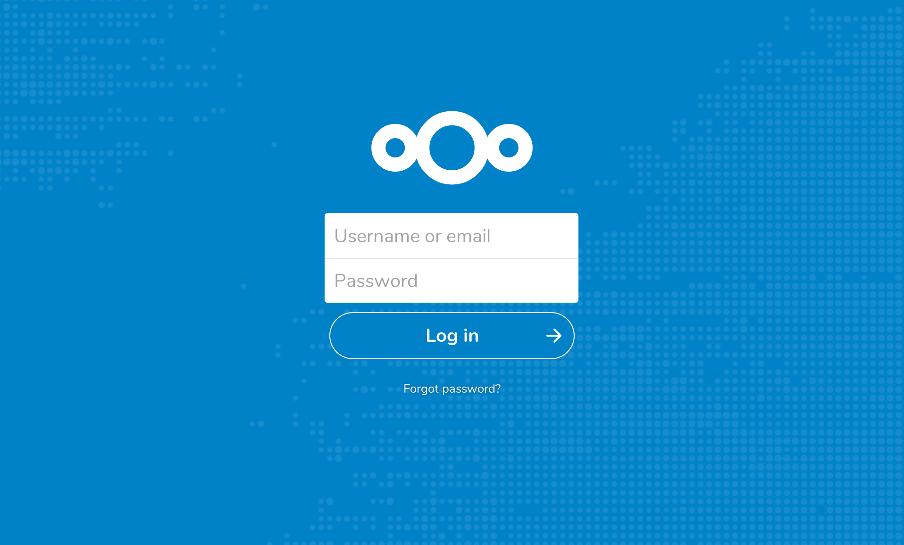

# Simple Nextcloud with Postgres from docker-compose

This repository contains a Docker compose file which can be used to easily create a Nextcloud instance connected to pg.

- Fully-featured Nextcloud instance backed by a Postgres database
- All volume data stored locally



## Architecture

Docker containers:

- `nextcloud`: the Nextcloud server
- `postgres`: the database used by Nextcloud to store its configuration

## Usage

Follow the steps below to get nextcloud running in docker on localhost

- Configure the .env files with the creds for your postgres db and admin user
- Run `docker-compose up` then connect to your postgres instance
- Create your user as per `POSTGRES_USER` and `POSTGRES_PASSWORD`
- Restart your nextcloud container
- Run `docker-compose restart`
- Open nextcloud at `localhost:8080` and login with `NEXTCLOUD_ADMIN_USER` and `NEXTCLOUD_ADMIN_PASSWORD`
- Nextcloud should prompt you to login and setup all the db stuff for you 

Run on your server without shell:

```
$ docker-compose up -d
```
